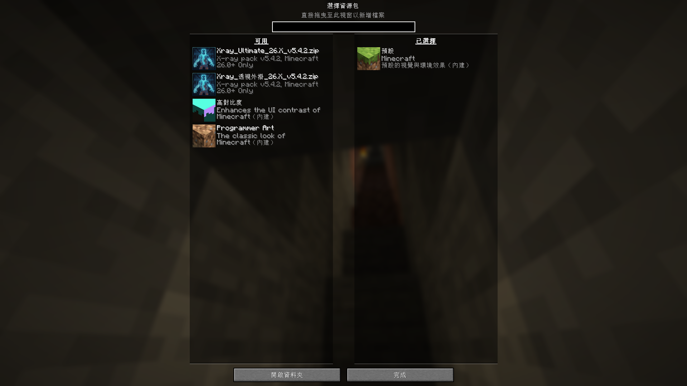
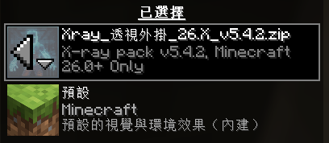

#  Minecraft Xray 資源包使用與設定指南

| 項目 | 資訊 |
| :--- | :--- |
| **適用版本** | `26.X v5.4.2` |
| **文章更新日期** | 2026 / 07 / 31 |
| **官方下載頁面** | [CurseForge - Xray Ultimate](https://www.curseforge.com/minecraft/texture-packs/xray-ultimate-1-11-compatible) |

> ⚠️ **重要注意事項**
> 1. **務必詳閱關閉步驟:** 若未正確停用，遊戲畫面將持續保持方塊透明化或出現材質錯亂。
> 2. **需要光源或夜視:** 透視資源包僅將普通方塊透明化，地底深處若無光源或夜視效果，礦石仍會呈現一片漆黑。
> 3. **伺服器自帶外掛:** 你不需要下載即可在伺服器開啟。

---

## 🟢 步驟 1：開啟與啟用 Xray 資源包

1. **開啟系統主選單**  
   進入遊戲後，按下鍵盤左上角的 **`ESC`** 鍵，點選 **「選項...」**。

2. **進入資源包管理頁面**  
   在選單中點擊 **「資源包...」** 按鈕。

3. **移動檔案至「已選取」列表**  
   在左側「可用的資源包」列表中找到 **`Xray_透視外掛_26.X_v5.4.2.zip`**。  
   將滑鼠移至圖示上，點擊出現的 **向右箭頭 `▶`**，將其移至右側欄位。

   

4. **套用設定**  
   確認該資源包出現在右側「已選取的資源包」中，點擊下方的 **「完成」** 按鈕，等待載入完畢。

---

## 🔴 步驟 2：關閉與停用 Xray 資源包

1. **重新進入資源包頁面**  
   按下 **`ESC`** 鍵 ➔ 點選 **「選項...」** ➔ 點選 **「資源包...」**。

2. **將資源包移出右側欄**  
   在右側「已選取的資源包」列表中找到 **`Xray_透視外掛_26.X_v5.4.2.zip`**。  
   將滑鼠懸停於圖示上，點擊出現的 **向左箭頭 `◀`**。

   

3. **恢復預設材質**  
   點擊下方的 **「完成」** 按鈕，遊戲將重新載入並恢復原本的普通畫面。

---

## 💡 視覺最佳化與進階技巧

- **關閉光影包（Shaders）：**  
  開啟光影時，透視區域可能會出現黑色陰影或渲染異常。使用 Xray 時建議暫時關閉光影。